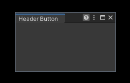

What-Unity-Does-Not-Tell-You
===

**Unity APIs that may be useful but not mentioned in the documentation.**


## Full lists of undocumented APIs

*Tip: Press **Ctrl+F** on the list page to search for the keyword of the content you are looking for.*

- [Unity 2021.3.0f1 Undocumented APIs](./Unity_2021.3.0f1_Undocumented_APIs.md)
- [Unity 2020.3.0f1 Undocumented APIs](./Unity_2020.3.0f1_Undocumented_APIs.md)
- [Unity 2019.4.0f1 Undocumented APIs](./Unity_2019.4.0f1_Undocumented_APIs.md)


## Frequently Used APIs

---
**Draw buttons on the header area of the EditorWindow:**

```csharp
// Unity message method
// Put in your EditorWindow class
void ShowButton(Rect position)
```

[Sample Code](./sample_codes/HeaderButtonSampleWindow.cs)



---
**Open asset in a custom EditorWindow when double-clicking:**

```csharp
[CreateAssetMenu(fileName = nameof(MyCustomAsset), menuName = "Tests/My Custom Asset")]
public class MyCustomAsset : ScriptableObject { }

public class MyCustomAssetEditorWindow : EditorWindow
{
    [OnOpenAsset]
    static bool OnOpenAsset(int instanceID, int line, int column)
    {
        if (EditorUtility.InstanceIDToObject(instanceID) is MyCustomAsset myAsset)
        {
            var window = GetWindow<MyCustomAssetEditorWindow>();
            window.SetTarget(myAsset);
            window.Focus();

            // Returning true indicates that the open operation has been processed
            // and the callback is not continued.
            return true;
        }

        // Returning false indicates that the open operation cannot be handled here,
        // and other methods in the callback should be continued.
        return false;
    }

    public void SetTarget(MyCustomAsset target)
    {
        // Do anything you want here.
        titleContent = new GUIContent(target.name);
        Debug.Log($"Open {target}.");
    }
}
```

---
**Keep serialized data after changing name or namespace of type:**

*Similar to `UnityEngine.Serialization.FormerlySerializedAsAttribute` .*

```csharp
UnityEngine.Scripting.APIUpdating.MovedFromAttribute
```

---
**Read/Write assets in Library/ProjectSettings/UserSettings folder:**

```csharp
UnityEditorInternal.InternalEditorUtility.LoadSerializedFileAndForget()

UnityEditorInternal.InternalEditorUtility.SaveToSerializedFileAndForget()
```

---
**Many helpful editor utility functions:**

```csharp
UnityEditorInternal.InternalEditorUtility
```

---
**To be continued...**
